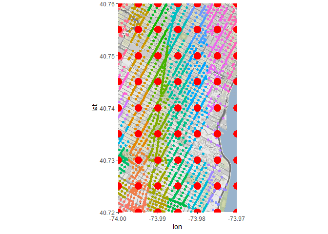

ArrestData
================
Kevin Cummiskey
10/21/2020

``` r
library(tidyverse)
library(spacetime)
library(sp)
library(lubridate)
library(ggmap)
library(data.table)
```

The below code reads in the arrest data. This takes time, which is
annoying because nothing changes but you need the data everytime you
compile this document. Therefore, I recommend caching the results below
(see Rmd file). As long as you don’t edit this R chunk, the results will
load from memory which is much faster than redownloading every time.

``` r
arrests <- read_csv(file = "data/NYPD_Arrests_Data__Historic_.csv")

# convert the ARREST_DATE column to a Date
# this will make it easier later because you can use functions in the lubridate package
arrests <- arrests %>% 
  mutate(ARREST_DATE = mdy(ARREST_DATE))

# use only a sample of 2015 arrests for now to speed things up
set.seed(10)
arrests2015 <- arrests %>% 
  filter(year(ARREST_DATE) == 2015) %>% 
  sample_n(5000)
```

The below code caches the map so you don’t have to download it every
time.

``` r
#it's easiest if you load the map once and then cache it, so it doesn't have to 
# import it everytime
#outline of New York City
nyc <- c(left = -74.3,
         right = -73.6, 
         top = 40.95,
         bottom = 40.4)

nyc_map <- get_stamenmap(bbox = nyc, zoom = 10, type = "toner-lite")
```

Now, plot using the downloaded map.

``` r
nyc_map %>% ggmap() +
  geom_point(aes(x = Longitude, y = Latitude), data = arrests2015)
```

<!-- -->

So, I’m thinking we should start simpler and build out from there. Let’s
consider only arrests that occured in Times Square in 2015.

``` r
read.table(file = "http://www.isi-stats.com/isi2/data/homeprices.txt", header = T)
```

    ##    sqft price.1000         lake
    ## 1  2700      639.9    lakefront
    ## 2  3353      898.0    lakefront
    ## 3  1600      410.0    lakefront
    ## 4  1740      529.9    lakefront
    ## 5  1907      495.0    lakefront
    ## 6  3262      749.9    lakefront
    ## 7  1336      199.9 notlakefront
    ## 8  2410      324.9 notlakefront
    ## 9   903      119.0 notlakefront
    ## 10 3168      309.9 notlakefront
    ## 11 1668      179.9 notlakefront
    ## 12 2276      210.0 notlakefront
    ## 13 2240      238.5 notlakefront

``` r
left = -74
right = -73.97
top = 40.76
bottom = 40.72

timessquare <- c(left = left, right = right, top = top, bottom = bottom)

#filter points in Times Square
arrests_timessquare2015 <- arrests %>% 
  filter(Latitude < top,
         Latitude > bottom,
         Longitude < right,
         Longitude > left) %>% 
  filter(year(ARREST_DATE) == 2015)

timessquare_map <- get_stamenmap(timessquare, zoom = 15, type = "toner-lite")

timessquare_map %>% ggmap() +
  geom_point(aes(x = Longitude, y = Latitude), data = arrests_timessquare2015)
```

<!-- -->

Next, I think the best way for us to approach this data initial is to
produce a grid (lattice) of points. Then, assign each arrest to one of
the grids. Then, we can complete an analysis similar to that in Lab 3.4.

``` r
lattice <- expand_grid(Longitude = seq(timessquare[1], timessquare[2], by = 0.005),
            Latitude = seq(timessquare[4], timessquare[3], by = 0.005))

#add an id to each location
lattice <- lattice %>% 
  mutate(grid = paste("L",1:n(), sep = ""))

lattice <- data.table(lattice)

#plot a map of the grid

timessquare_map %>% ggmap() +
  geom_point(aes(x = Longitude, y = Latitude), data = arrests_timessquare2015) +
  geom_point(aes(x = Longitude, y = Latitude), data = lattice, col = "red", size = 5)
```

<!-- -->

Next, let’s assign each arrest to the appropriate grid.

``` r
#arrests locations
arrests_loc <- arrests_timessquare2015 %>% 
  select(ARREST_KEY, Longitude, Latitude) %>% 
  data.table()

#matrix of bounds
bounds <- lattice[, .(xl = Longitude - 0.0025,
                  xu = Longitude + 0.0025,
                  yl = Latitude - 0.0025,
                  yu = Latitude + 0.0025,
                  grid)]

#assign each arrest to the appropriate grid
assignments <- bounds[arrests_loc, .(ARREST_KEY,grid),
                      on = .(xl <= Longitude, xu >= Longitude,
                             yl <= Latitude, yu >= Latitude)]

assignments <- as_tibble(assignments)

#add grid information to arrests data
arrests_timessquare2015 <- arrests_timessquare2015 %>% 
  left_join(assignments, by = "ARREST_KEY")

#this plot shows how points are assigned to the grids
timessquare_map %>% ggmap() +
  geom_point(aes(x = Longitude, y = Latitude, color = grid), 
             data = arrests_timessquare2015) +
  geom_point(aes(x = Longitude, y = Latitude), data = lattice, col = "red", size = 5) +
  theme(legend.position = "none")
```

<!-- -->

Next, let’s aggregate the arrests to the grid level and display the
results on a map.

``` r
arrests_grid <- arrests_timessquare2015 %>% 
  count(grid) %>% 
  left_join(lattice)
```

    ## Joining, by = "grid"

``` r
#plot the aggregated results
timessquare_map %>% ggmap() +
  geom_point(aes(x = Longitude, y = Latitude, size = n), data = arrests_grid)
```

<!-- -->
